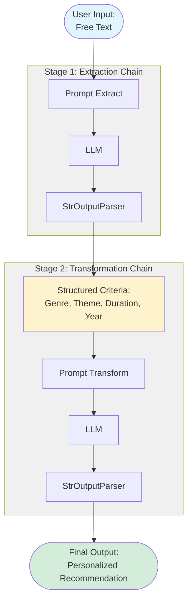

# Prompt Chaining - Usando conceitos de arquitetura para construir agentes de IA

## 1\. Introdução ao Prompt Chaining

O prompt chaining, também chamado de padrão **Pipeline**, é uma técnica fundamental para lidar com tarefas complexas usando Grandes Modelos de Linguagem (LLMs) ao adotar uma estratégia de **dividir para conquistar**.

Em vez de tentar resolver um problema grande em uma única etapa com um prompt gigantesco e complexo de maneira monolítica, essa abordagem decompõe a tarefa em uma sequência de subproblemas menores. 
A chave do processo é que a saída de um prompt serve estrategicamente como entrada para o próximo.

Essa modularidade aumenta a **confiabilidade** e o **controle** sobre o processo. 
Cada etapa na cadeia pode ser desenvolvida, testada e otimizada de forma independente, facilitando a depuração e a manutenção.

Esse conceito serve como espinha dorsal na construção de **agentes de IA sofisticados**, pois permite:

  - Raciocínio em múltiplas etapas.
  - Gerenciamento de estado entre as etapas.
  - A integração de ferramentas externas ou conhecimento estruturado (como dados em JSON ou chamadas de APIs).

Ao adotar essa abordagem, você ganha controle, reduz a complexidade e abre portas para a criação de aplicações de IA muito mais poderosas e sofisticadas.

## 2\. Conexões com a Engenharia de Software

O conceito de prompt chaining não é uma invenção do zero. Ele é uma aplicação direta de padrões de arquitetura e design de software testados e aprovados ao longo de décadas.
Entender essas conexões ajuda a construir sistemas de IA mais sólidos e escaláveis.

### Padrões Arquiteturais e suas Correlações

| Padrão Arquitetural/Design | Conceito Central                                                     | Correlação com Prompt Chaining                                                                                   |
| :------------------------- | :------------------------------------------------------------------- | :--------------------------------------------------------------------------------------------------------------- |
| **Pipes and Filters** | Dados fluem por uma série de componentes de processamento independentes. | **A correlação mais direta.** Cada prompt é um "filtro" e a saída é o "cano" para o próximo.                       |
| **Microsserviços** | Aplicação construída como um conjunto de serviços pequenos e autônomos. | Cada prompt atua como um serviço com uma única responsabilidade, facilitando a modularidade e a manutenção.       |
| **Chain of Responsibility**| Passa uma requisição por uma cadeia de manipuladores.                | Em agentes complexos, um prompt pode rotear a tarefa para diferentes "sub-chains" dependendo do contexto.        |
| **Decorator** | Adiciona funcionalidade a um objeto de forma incremental e dinâmica.     | Cada prompt na cadeia pode "decorar" a informação, adicionando formatação, dados ou contexto.                      |
| **Saga** | Gerencia transações de longa duração em sistemas distribuídos com compensações. | Relevante para agentes de IA que executam tarefas complexas e precisam de mecanismos de tratamento de erros. |


## 4\. Exemplo de Uso - Recomendador de Séries de TV

### 4.1 Fluxo de Dados do Pipeline



### 4.2 Descrição do Exemplo

**Input do Usuário (Texto Bruto):**

> "Queria ver uma série de ficção científica que tenha mistério, tipo Black Mirror, mas que não seja muito longa. E que seja mais nova, dos últimos 2 anos."

#### Etapa 1: `extraction_chain` (Extrair Critérios de Busca)

**Responsabilidade:** Identificar os parâmetros de busca na fala do usuário.

**Prompt (`prompt_extract`):**

```prompt
Extraia os critérios para encontrar uma série do texto a seguir: gênero principal, subgênero ou tema, exemplos, restrição de duração e ano de lançamento.

Texto: "{text_input}"
```

**Saída Esperada (string limpa):**

```text
Critérios de Busca:
- Gênero: Ficção Científica
- Tema: Mistério
- Exemplo similar: Black Mirror
- Duração: Curta (não muito longa)
- Ano de Lançamento: Após 2023
```

#### Etapa 2: `full_chain` (Gerar uma Sugestão Personalizada)

**Responsabilidade:** Usar os critérios para formular uma recomendação, como se fosse um especialista em streaming.

**Prompt (`prompt_transform`):**

```prompt
Com base nos critérios de busca abaixo, sugira 1 série específica e escreva uma pequena sinopse do porquê o usuário vai gostar dela.

Critérios: "{search_criteria}"
```

**Saída Final (Recomendação em texto):**

```text
Com certeza! Baseado no que você procura, uma excelente sugestão é **"Ruptura" (Severance)**.

É uma série de ficção científica com uma trama de mistério que vai te prender do início ao fim. 
Assim como em Black Mirror, ela explora o impacto da tecnologia na sociedade de uma forma inquietante. 
Os episódios são concisos e a produção é recente, se encaixando perfeitamente no que você pediu!
```


## 8\. Próximos Passos

1. **Adicionar persistência**: Salvar critérios extraídos para análise
2. **Implementar feedback loop**: Permitir que usuário refine recomendações
3. **Integrar APIs externas**: Buscar séries em catálogos reais (TMDB, IMDB)
4. **Adicionar mais padrões**: ReAct, Tool Use, Multi-Agent Systems
5. **Implementar tratamento de erros**: Retry logic, fallbacks, compensações


