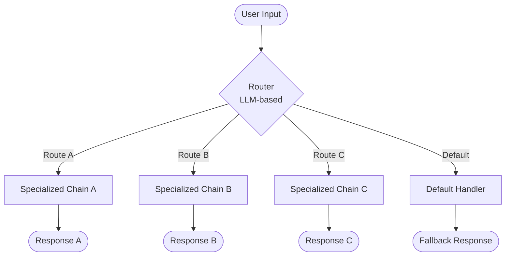
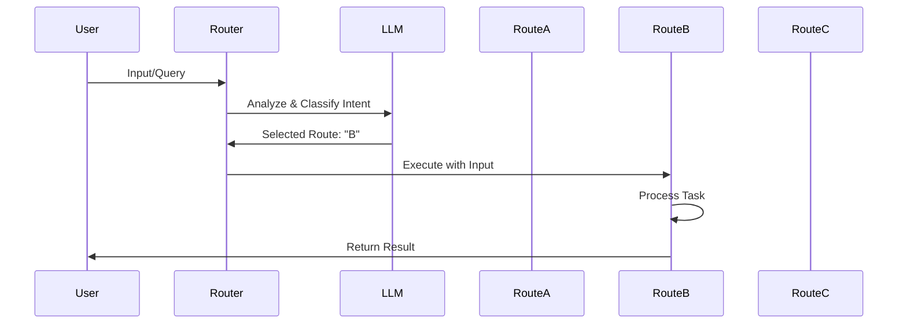

# Routing (Roteamento) - Sistemas de Tomada de Decisão Dinâmicos

## 1. Introdução ao Routing

O padrão **Routing** (ou Roteamento) transforma um agente de IA de um executor de tarefas linear em um sistema de tomada de decisão dinâmico. Em vez de seguir um único caminho pré-definido, o agente primeiro analisa a entrada do usuário ou o estado atual para decidir qual é o melhor caminho a seguir.

Essa capacidade de escolher entre múltiplas ações, ferramentas ou subagentes especializados é o que permite a criação de sistemas **flexíveis** e **sensíveis ao contexto**.

### Conceito Central

Em essência, o Routing introduz uma **lógica condicional** no fluxo de trabalho do agente:

- **"Se a intenção é X, faça Y; se for A, faça B"**

Isso permite que um assistente virtual, por exemplo, diferencie um pedido de "tocar música" de uma pergunta sobre "a previsão do tempo" e acione a ferramenta correta para cada tarefa.

### Benefícios do Padrão

- **Especialização**: Diferentes rotas podem usar modelos ou estratégias específicas
- **Eficiência**: Apenas os recursos necessários são acionados
- **Escalabilidade**: Fácil adicionar novas rotas sem modificar as existentes
- **Manutenibilidade**: Cada rota pode ser testada e otimizada independentemente

## 2. Tipos de Implementação do Roteador

O componente central do padrão é o **Roteador**, que pode ser implementado de várias formas:

| Tipo de Roteador | Descrição | Quando Usar |
| :--------------- | :-------- | :---------- |
| **Baseado em LLM** | O próprio modelo de linguagem decide para onde direcionar a tarefa | Quando a lógica de roteamento é complexa e contextual |
| **Baseado em Regras** | Lógica explícita (if/else) que busca por palavras-chave | Para casos simples e determinísticos |
| **Baseado em Embeddings** | Compara o significado semântico da entrada com as rotas disponíveis | Quando há muitas rotas e precisão semântica é importante |
| **Baseado em Modelo ML** | Utiliza um classificador treinado especificamente | Para alta performance e latência mínima |

### Routing Baseado em LLM (Foco deste Exemplo)

Nesta abordagem, o LLM atua como um "classificador inteligente" que:

1. **Analisa** a intenção ou conteúdo da entrada
2. **Decide** qual rota é mais apropriada
3. **Direciona** a execução para o caminho escolhido

**Vantagens:**
- Entende contexto e nuances
- Não requer treinamento adicional
- Flexível para adicionar novas rotas

**Desvantagens:**
- Maior latência (chamada extra ao LLM)
- Custo adicional por requisição
- Pode ser inconsistente em casos ambíguos

## 3. Conexões com a Engenharia de Software

O padrão Routing está diretamente relacionado a padrões de design e arquitetura estabelecidos:

| Padrão de Design | Conceito Central | Correlação com Routing |
| :--------------- | :--------------- | :--------------------- |
| **Strategy** | Encapsula algoritmos intercambiáveis e permite seleção em runtime | Cada rota é uma estratégia; o roteador seleciona qual usar |
| **Chain of Responsibility** | Passa requisições por uma cadeia de handlers | O roteador decide qual handler ativar baseado no contexto |
| **State Machine** | Comportamento muda baseado no estado interno | Routing pode implementar transições entre estados/rotas |

## 4. Arquitetura Típica de um Sistema com Routing



## 5. Fluxo de Execução



## 6. Exemplo de Uso: Sistema de Triagem Médica

Este exemplo implementa um **Roteador de Triagem Médica** usando **LangChain** e **Routing baseado em LLM**.

### Caso de Uso

Um sistema que recebe consultas de pacientes em linguagem natural e direciona para a especialidade médica apropriada:

- **Pediatria**: Saúde infantil, bebês, vacinação
- **Nutrologia**: Dieta, alimentação, perda/ganho de peso
- **Psicologia**: Saúde mental, ansiedade, estresse
- **Fisioterapia**: Dores físicas, lesões, reabilitação
- **Default**: Saudações e casos gerais

### Arquitetura da Implementação

```
User Query → [Router LLM] → Specialty Selection → [Specialized Agent] → Response
```

Cada especialidade possui:
1. **Prompt personalizado**: Tom e foco específicos da especialidade
2. **Chain dedicada**: `Prompt | LLM | Parser`
3. **Personalidade**: Linguagem apropriada ao contexto médico